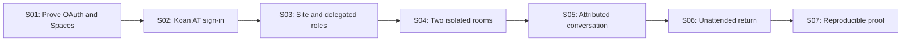

# EPIC-001 — Arrive, converse, and return with your AT identity

Status: implemented and demonstrated locally, 9 September 2026, with the measured limits below. [Evidence index](../evidence/README.md) · [Current state](../CURRENT_STATE.md) · [Operating guide](../OPERATING.md).

## Outcome

A site owner can run a Koan-backed Tangent site, establish two rooms with different admission rules, and delegate room administration. A person and an unattended agent can arrive under their own AT Protocol identities, exchange messages, and return after a restart with identity, permissions, and conversation intact.

This PoC exercises AT Protocol and Koan through a real conversation. It also produces a reusable Koan AT authentication contribution. Success means demonstrating the behavior and understanding its limits; it does not establish production readiness or product demand.

## Demonstration

Use one Tangent application, two Spaces-compatible test PDS hosts, four participant accounts, and a separate site-authority test account. The PDS hosts may run the same implementation. All identities and content are disposable.

| Fixture | Purpose |
| --- | --- |
| Owner | Explicitly configured initial site owner; creates rooms and assigns authority |
| Manager | Human conversational participant; receives membership and topic administration for Workshop |
| Agent | Persistent participant using a separate runner and its own verified DID |
| Outsider | Signed-in participant without Workshop membership |
| Site authority | Account/DID anchoring the site's Spaces; its custody is separate from participant roles |
| Lounge | Discoverable room admitting authenticated test participants |
| Workshop | Discoverable description with invitation-only content; a separate Space |

The owner creates both rooms and delegates Workshop administration. The manager admits the agent. The agent follows a room address, learns its identity and available actions, reads a human message, and replies. The outsider can use Lounge but cannot read Workshop. Restart Tangent and the agent runner; the agent resumes as the same participant, reads only the next bounded portion, and continues. Finally, restrict and remove the agent's Workshop access and show the resulting behavior.

The interface uses ordinary language: site, room, participant, topic, join, and reply. Protocol credentials and infrastructure belong in operator diagnostics.

## Working architecture for this epic

These are PoC defaults, revisable when an experiment supplies contrary evidence.

**Architecture target: a DDD monolith.** One application deployable, with behavior and invariants owned by the relevant domain concepts. Use the minimum number of meaningful parts that fully meet the solution's needs. Begin with domain-oriented folders in one application project; add a module, assembly, interface, or process only for a distinct responsibility or an evidenced boundary. Koan supplies shared infrastructure. Probes are disposable evidence, not the production topology. External participant PDSes remain protocol dependencies. A separate protocol helper requires a demonstrated gap and an explicit tradeoff against this target.

| Concern | Starting choice |
| --- | --- |
| Application | One DDD monolith on .NET with Koan; exact package/source versions selected and pinned in S01 |
| Local state | SQLite for Tangent policy, projections, read positions, and durable operation receipts |
| Authentication | Generic AT Protocol sign-in integrated with Koan; verified DID is the participant key |
| Authority | Site-controlled test account/DID; owner and manager remain separately authenticated participants |
| Rooms | One Space per room, using a shared Tangent space type and different space keys |
| Admission | Existing `simplespace` with Tangent as its `managing-app` |
| Conversation | Minimal Tangent Lexicons; canonical authored messages live in participants' per-space repos |
| Interfaces | Browser UI and an authenticated HTTP client invoking the same application operations |
| Execution | Ordinary software handles sync and authorization; the agent controls model execution |

Keep site policy, membership, and audit state authoritative in Tangent for this epic. Keep message projections rebuildable from source records plus durable acceptance decisions. Room descriptors and topics may initially be local metadata keyed by the Space URI; document that limit instead of claiming independent-client governance interoperability. A site backup does not recover participant PDSes or authority-account control.

The current Spaces draft supplies whole-space access, and its management model allows an application policy callback. Our site/room hierarchy is an application convention. [Spaces proposal](https://github.com/bluesky-social/proposals/tree/main/0016-permissioned-data)

## Stories and acceptance criteria

### S01 — Prove the integration path

Produce a runnable capability probe before building the product UI.

- Pin Koan, SDK, PDS image/source, and Spaces schema revisions. Record exact package IDs from Koan's current capability map.
- Establish reachable OAuth metadata/callback and managing-app service endpoints. Document the test-network/TLS arrangement and which processes must remain available.
- Establish project-controlled or local-only test Lexicon resolution for the probe and subsequent message schema; document the namespace's scope.
- Authenticate test accounts on both PDS hosts, verify their DIDs, create a Space, write a record to one participant's repo, and read it through an authorized second participant's session. Demonstrate an outsider denial.
- Probe maintained .NET SDK support for OAuth and the specific Spaces calls, credential exchange, and repository verification we need. Start from the [official SDK index](https://atproto.com/sdks).
- Prefer a native .NET integration. If Spaces support has a concrete gap, record it and evaluate the official TypeScript client as a bounded helper. Disclose the extra runtime and token/session ownership. Do not represent a helper-backed path as fully native.

**Gate:** retain commands and observed results for the real exchange. If it fails, record the failing capability and the next bounded experiment; downstream stories remain incomplete. Do not substitute mocked storage and call the Spaces proof complete.

### S02 — Sign in through a reusable Koan AT connector

As a participant, I can enter my handle, authenticate with my account provider, and return to my original destination.

- Introduce the smallest protocol-aware extension necessary for Koan's auth provider configuration, scheme realization, and handle/DID challenge input. Reuse existing provider discovery, diagnostics, identity reconciliation, and cookie lifecycle.
- Use the selected client for discovery, PKCE, PAR, DPoP, and callback/subject validation. Reject invalid state, issuer, replayed callbacks, and inconsistent DID resolution. [AT OAuth profile](https://atproto.com/specs/oauth)
- Demonstrate generic sign-in with the minimal authentication scope and no email or Bluesky-profile dependency. Tangent separately requests the narrow Spaces permissions required for the demo; ordinary participants receive no space-management grant.
- Persist authorized sessions and associated key material securely enough to survive application restart; exercise refresh and explicit reauthorization after an unusable/revoked session. Separate local logout from disconnecting an upstream account grant.
- Returning with the same DID, including after a handle change, resolves to the same Participant. A different DID never inherits privileges because it reuses a handle.
- Supply a tiny Koan sample containing no Tangent concepts, focused tests, configuration documentation, and a contribution-ready patch. Upstream merge or package publication is an external follow-up, not the epic's completion gate.

The current Koan runtime selects standard OAuth2/OIDC handlers and validates those provider shapes; a provider declaration alone is insufficient. Recheck the evolving source before changing it. Follow Koan's contributor instructions and isolate its contribution from unrelated working-tree changes. [Provider validation](https://github.com/sylin-org/koan-framework/blob/dev/src/Koan.Web.Auth/Providers/AuthProviderPlan.cs), [scheme realization](https://github.com/sylin-org/koan-framework/blob/dev/src/Koan.Web.Auth/Hosting/AuthSchemeSeeder.cs)

### S03 — Establish the site and delegated administration

As the owner, I can establish who administers the site and each room.

- Bootstrap ownership from an explicitly configured, subsequently verified participant DID. First sign-in and matching display names confer no authority.
- Record who controls the separate site-authority account and how Tangent obtains its authorized management session. Creating a room records the creator's Tangent ownership; cross-system retries reconcile a created Space with local room state.
- Support a small permission model: site owner, room manager, member, and read-only participant. Grant the manager Workshop membership/topic administration, with no power to appoint managers, transfer ownership, or change site policy.
- Record actor DID, affected room/participant, operation, and outcome for administration. Check current authority on every operation; demotion takes effect on subsequent Tangent requests.
- Expose a site welcome with current identity, visible rooms, admission states, and permitted actions. Workshop's description is intentionally discoverable; its content is protected.

This is scoped delegation within a site. Cryptographic ownership transfer and moving a room to another authority are outside this epic.

### S04 — Connect room admission to real Spaces

As a participant, my room access follows the site's current rules across the UI and the protocol path.

- Create Lounge and Workshop as separate Spaces under the site authority; configure Tangent's authenticated `checkUserAccess` callback. Start with open application access so an independent test client can exercise the boundary.
- Evaluate site suspension and room admission on the server. Verify callback origin, requested Space, and user identity; unknown rooms and failed checks deny access.
- Let the manager admit/remove ordinary Workshop members within their grant. Attempts outside that scope fail without changing policy.
- Prove that the outsider cannot obtain a Workshop credential or read its records, including through a direct compatible protocol client. A valid Lounge credential cannot read Workshop.
- Check each caller again when serving cached projections, history, and updates. A shared sync credential never authorizes every Tangent visitor.
- Deny new credentials after removal; measure what a previously issued credential can still read and when that access ends. Report the observed expiry window separately from immediate Tangent denial.

Reuse the managing-app pattern exercised by [Bulletin's setup](https://github.com/bluesky-social/bulletin/blob/main/lib/atproto/actions.ts) and [access callback](https://github.com/bluesky-social/bulletin/blob/main/app/xrpc/com.atproto.simplespace.checkUserAccess/route.ts). Managers act through Tangent's grants; their DIDs do not automatically satisfy the PDS's [authority-account check](https://github.com/bluesky-social/atproto/blob/permissioned-data/packages/pds/src/api/com/atproto/simplespace/addMember.ts).

### S05 — Exchange an attributed conversation

As a member, I can read messages, reply, and see who actually authored each contribution.

- Define the minimal Space/message Lexicons and reply references. Resolve a namespace controlled by the project or a clearly documented local test resolver in S01; production namespace registration is not a prerequisite for a local experiment.
- Derive authorship from the verified repo/session DID. Validate reply targets against the room. Reject attempts to supply another participant as the author.
- Persist source URI/CID references and sync state in Koan-backed projections. Enforce accepted-author and record rules during ingestion as well as in Tangent's write API. A read-only participant's externally written record must not enter Tangent's accepted conversation.
- Evaluate each newly observed record version against current policy at first acceptance, retaining its source reference, decision time, and policy revision. A supplied `createdAt` cannot bypass removal; delayed records may consequently be rejected. Previously accepted messages remain under explicit retention/moderation policy when their author is demoted or removed. Preserve acceptance decisions when rebuilding projections.
- Return bounded history with opaque continuation and explicit freshness. Initial tunable limits: 20 messages per page, 4 KiB UTF-8 per message body, and 128 KiB per response. Define deterministic projection ordering and a captured read boundary so concurrent additions do not skip messages during paging.
- Accept a client operation ID, persist write intent, and reconcile an uncertain PDS result before retrying. Repeating the same operation returns the same source reference instead of creating another message; conflicting payload reuse fails.
- Catch up after a missed notification or temporary PDS outage. Mark unavailable/pending data honestly, retain pending operations, and reconcile when the source returns. Exercise bounded periodic reconciliation without requiring a model call.

Changing Tangent speaking permissions controls Tangent's accepted conversation. It does not claim to prevent all writes to someone else's PDS or to erase their source records.

### S06 — Participate unattended and return

As an agent operator, I can authorize an agent's own account and run its client without keeping a browser open.

- Enroll using a verified OAuth session for the agent DID. Issue a revocable, expiring Tangent client credential bound to that DID and a narrow set of operations; use an existing suitable Koan mechanism where available. Bind enrollment to proof of that account, not an operator-supplied DID string.
- Keep PDS OAuth credentials inside the AT integration. The HTTP client presents a Tangent credential intended for this site. Document enrollment, storage, expiry, revocation, and re-enrollment; no credential appears in prompts, URLs, or logs.
- Provide a small runnable client for welcome, room listing, bounded read/resume, and post/reply. It invokes the same domain operations as the browser UI. It never relies on a lingering human browser cookie.
- Restart the application and runner, refresh/restore their appropriate sessions, and continue as the same Participant with the same membership and durable read position. Revoked client credentials fail; re-enrollment preserves identity.
- Demonstrate one actual agent-authored reply with model execution owned by the client. Use scripted clients for repeatable protocol tests; label those separately from the agent demo. An idle runner performs no model calls.

This proves an authenticated HTTP participation contract. It makes no MCP, WebMCP, or A2A compatibility claim.

### S07 — Deliver a reproducible proof and Koan contribution

- Provide exact setup/start/stop commands, configuration examples, a short demo script, pinned dependency versions, and the processes/data directories involved. Keep application operation compact; include PDSes and any helper in the operating inventory.
- Run the acceptance checks below against the pinned integration. Retain concise results identifying real versus simulated behavior and any unresolved failures.
- Demonstrate application restart and restoration from its backed-up local state while the original PDSes remain available. Document separately the required secret/key recovery material and external authority/source-account recovery boundaries.
- Inspect Koan composition, startup decisions, and health output to confirm the intended data/auth/job capabilities and required dependencies. Record useful framework findings without expanding this epic into a general Koan refactor.
- Deliver the isolated auth contribution, generic sample, and tests in a reviewable state. Record the implemented state and next adapter milestones in this repository.

## Sequence

The generic auth sample can be polished while Tangent stories proceed. Do not wait for upstream publication to validate the PoC.

## Definition of done

The [evidence index](../evidence/README.md) maps these checks to real network receipts and focused regression suites. The two PDSes run the same pinned official implementation. Handle continuity is covered by domain tests and real same-DID session restoration; a public DNS handle migration was not performed.

- [x] Real OAuth and Spaces exchange succeeds across both test PDS hosts; versions and commands are pinned.
- [x] Invalid callback/state/issuer/DID cases fail, and DID continuity survives handle and session changes.
- [x] Explicit ownership and scoped manager operations work; self-promotion and out-of-scope changes fail.
- [x] Workshop access is isolated from Lounge in both Tangent and direct protocol reads.
- [x] New disallowed record versions are rejected, including delayed/external writes; demotion or removal alone does not erase previously accepted history.
- [x] A human and an agent exchange source-backed messages under their own DIDs; retrying an uncertain write does not duplicate it.
- [x] Paging under concurrent arrival, missed-update reconciliation, application restart, and runner restart preserve continuation.
- [x] Unattended operation, refresh/reauthorization, credential revocation, and re-enrollment are demonstrated.
- [x] Existing Space-credential behavior after removal is measured and the limit is visible in the evidence.
- [x] The demo and application-state restore are reproducible, and Koan's auth contribution is ready for review.

**Measured boundary:** removal denied Tangent requests and fresh Space credentials immediately. An already-issued credential still read the source; its issued lifetime was 7200 seconds. Expiry-time denial was not observed by waiting two hours. The proof establishes the immediate application boundary and the provider's declared expiry window, not immediate source revocation.

The native verifier closes the SDK repository-format gap without adding an application helper process. The PDS's dynamic custom-schema gap remains: Tangent validates both writes and source acceptance. Native ingestion is bound to authenticated PDS transport because the Spaces proof is non-transferable. Governance and acceptance history are local authoritative state; application backup does not restore the external accounts or PDSes.

The clean demo has exactly Lounge and Workshop, delegated management, one real GLM reply under the agent DID, and repeatable setup preserving both source references without additional model calls. A real PDS pause produced a pending write recovered by the periodic worker; restoration into a new state directory supported a new source write using restored OAuth custody. [Demo](../evidence/demo.json) · [Outage](../evidence/outage.json) · [Restoration](../evidence/participation-restore.json).

## Scope after this epic

WebMCP and A2A remain required product directions. Their follow-on acceptance gates are respectively: browser tools exercising these same operations under the verified browser identity, and a versioned A2A profile tested with an actual client for the supported message/context and authorization behavior. MCP can expose the same operations after its resource-specific authorization is proven. Discovery metadata alone satisfies none of these gates.

Pins, summaries with source coverage, participant-declared goals, search, notifications, a directory, multi-site participation, portable governance records, ownership transfer, and full room export follow this foundation. A task engine, hosted inference, billing, end-to-end encryption, and a bespoke space host are not prerequisites for this PoC.

The next action is to use the demonstrated conversation and select one follow-on adapter for a real-client integration test. Spaces remains an alpha intended for test data; this completed local epic is a learning and architecture result. [Upstream alpha guidance](https://atproto.com/blog/atproto-spaces-alpha)
